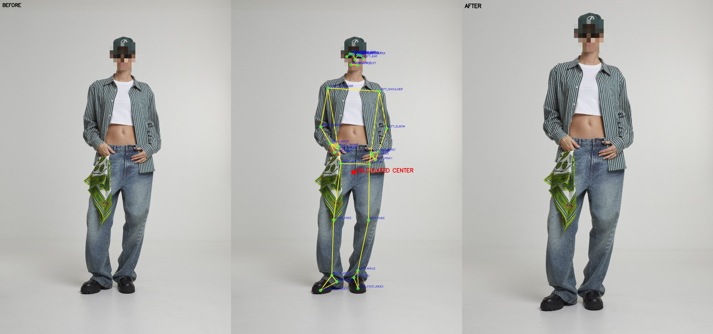
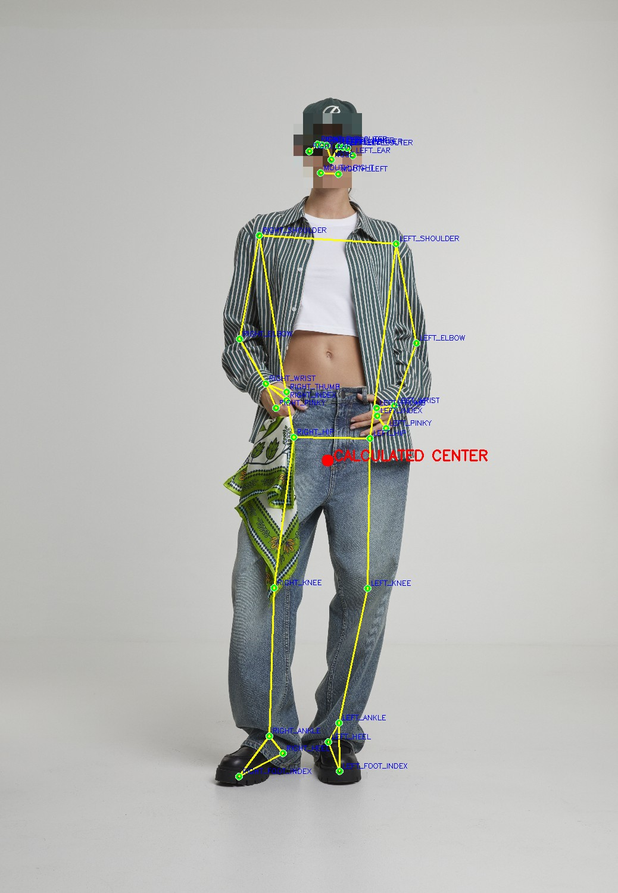
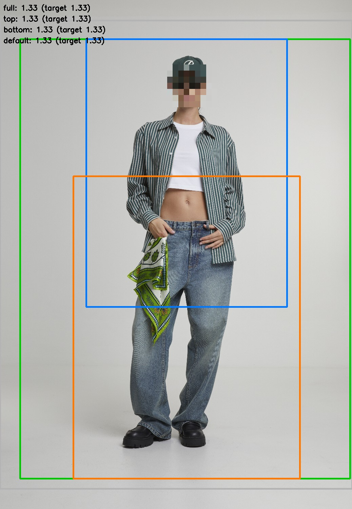
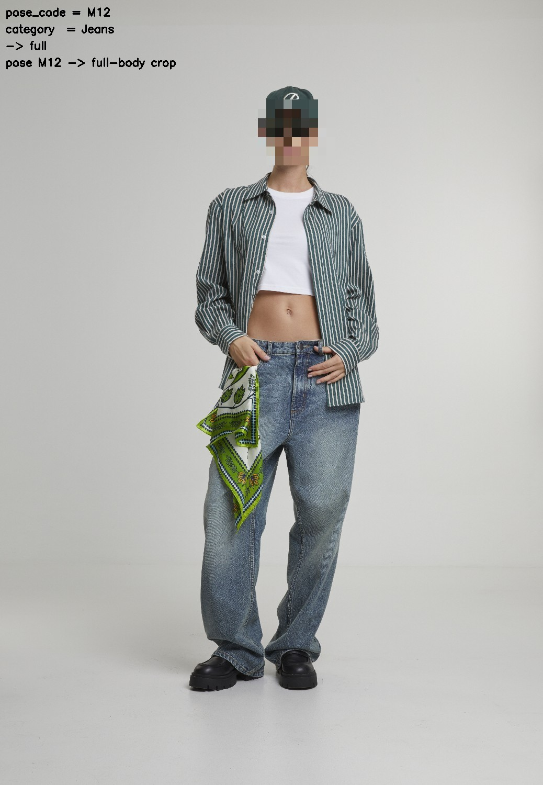
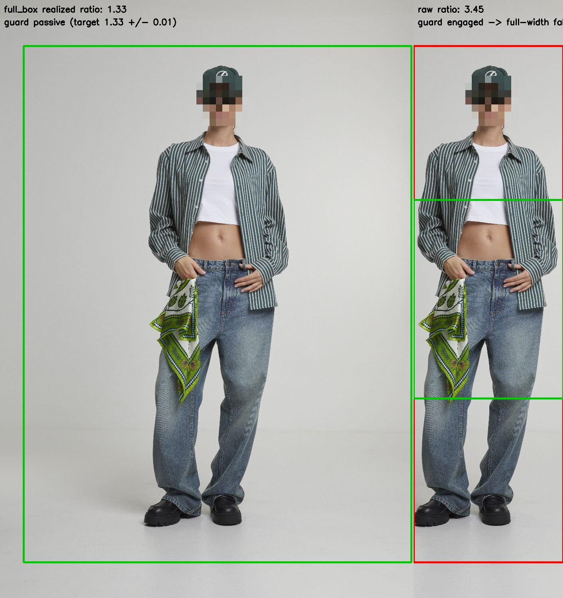
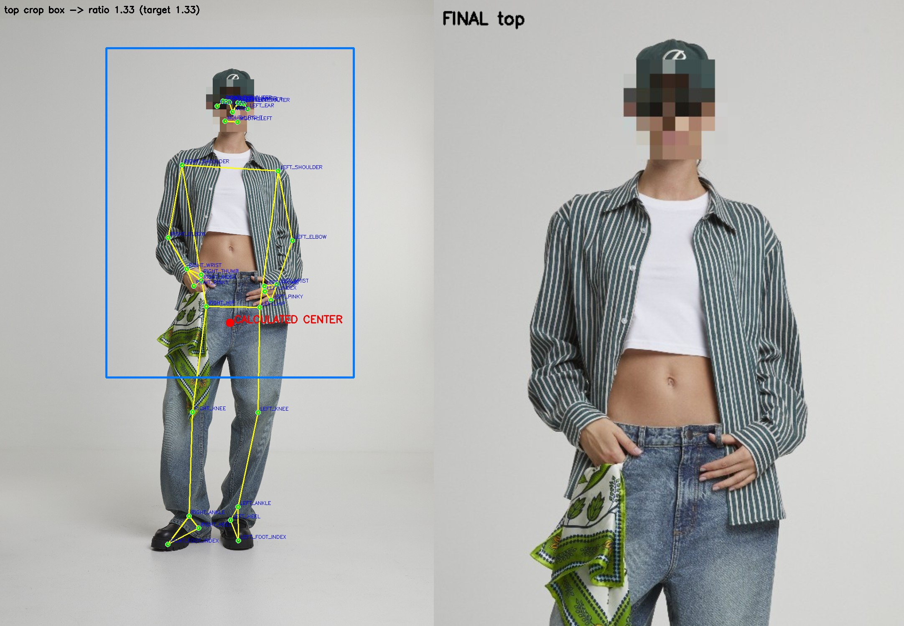
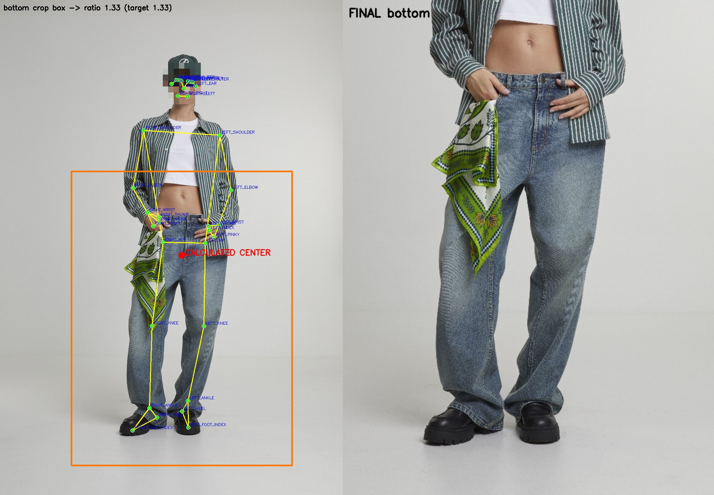
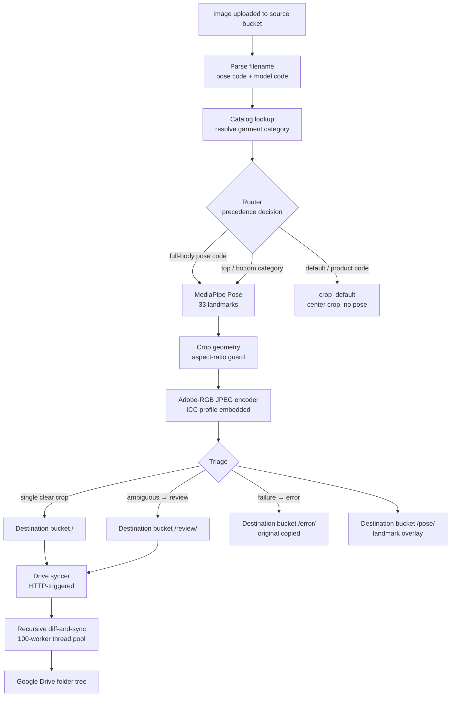

# Automated Image Cropping Pipeline (GCP)

**`posecropper` — event-driven, pose-aware automatic catalog image cropping for fashion e-commerce.**

Drop a studio photo into a cloud bucket and it detects the model's pose, looks up the garment category in a product database, picks the correct framing (full body, top, or bottom), and emits a fixed-aspect-ratio, color-managed crop — routing only the ambiguous cases to a human reviewer.



*Before → pose detection → after: the original studio frame, the 33-point MediaPipe overlay, and the delivered aspect-ratio-correct catalog crop.*

📄 **[Project presentation (PDF)](docs/presentation.pdf)** — slide deck walking through the logic, setup, image-processing pipeline, and output structure.

---

## Production Outcome

Deployed for a German fashion e-commerce retailer and running in daily production use:

| Metric | Result |
|--------|--------|
| Active users | ~6 photographers across 3 studios |
| Manual post-processing time | cut by ~30% |
| Manual cropping labour removed | ~2 FTE |

These figures are author-confirmed operational results from the production deployment — not metrics computed in this repository.

---

## What It Does

posecropper is a serverless pipeline that turns raw studio fashion photos into catalog-ready crops automatically. When an image is finalized in cloud storage, the function parses its filename for a product code and a pose code, resolves the garment's category from a product database, and uses both signals to choose a crop strategy. MediaPipe Pose locates the subject's 33 landmarks; the chosen strategy computes a fixed-aspect-ratio crop centered on the body, verifies the realized ratio and falls back to a safe full-width crop if a frame-edge subject would break it, and writes the result at full JPEG quality with an embedded Adobe RGB profile. Clear cases produce one crop; ambiguous ones produce both top and bottom and land in a review folder, while failures copy the original to an error folder. A separate function then syncs the cropped output into Google Drive.

**Features at a glance:**

- Event-driven Cloud Functions — fires on every image upload, no manual run step
- Metadata-driven crop router combining filename pose codes with a live product-category lookup
- MediaPipe Pose (33 landmarks) plus geometric, aspect-ratio-guarded cropping with graceful fallback
- Four active crop strategies (full, top, bottom, default) behind one router
- Full-quality JPEG output with an embedded Adobe RGB ICC profile
- Per-image pose-landmark diagnostics, automatic `/error/` capture, and `/review/` triage
- Companion sync function: concurrent, recursive, idempotent bucket-to-Drive mirroring

---

## Visualization Gallery

| | |
|---|---|
|  |  |
| **Pose overlay** — all 33 MediaPipe landmarks and skeleton connections with the computed body center marked | **Candidate crop boxes** — full, top, bottom, and default crop regions color-coded with their realized aspect ratios |
|  |  |
| **Router decision** — annotation of the pose code + category → strategy path taken (here an explicit pose code overrides the category) | **Aspect-ratio guard** — frame-edge fallback: on a forced tall-narrow case the off-spec raw geometry (red) is replaced by the full-width center crop (green) |

**Process → product** — the keypoints and the crop box the strategy computes, beside the final delivered crop:

| | |
|---|---|
|  |  |
| **Top** — upper-body framing anchored on the body center | **Bottom** — lower-body framing anchored on the body center |

> Assets are generated by running the demo on the bundled sample image (`examples/sample.jpg`). See [Local demo quickstart](#local-demo-quickstart). The sample model's face is pixelated for privacy; the committed sample is pre-anonymized, so re-running the demo reproduces the same blurred gallery.

---

## Architecture

### Processing flow



### Router precedence

The router (`posecropper/router.py`) applies these branches in order — the first match wins:

| Priority | Condition | Strategy |
|----------|-----------|----------|
| 1 | Pose code in `{M12, M13, M14, M15, M16, M32, M35, M36}` | **full-body crop** (pose detection + full-skeleton geometry) |
| 2 | Pose code in `{M17 … M31}` | **default crop** (center crop, pose detection skipped) |
| 3 | Pose code starts with `P` (product / flat-lay) | **default crop** (product segmentation path disabled) |
| 4 | Garment category = `top` | **top crop** (upper-body framing) |
| 5 | Garment category = `bottom` | **bottom crop** (lower-body framing) |
| 6 | Otherwise (accessory, unknown, review category) | **both top + bottom crops → `/review/`** |

An explicit, known pose code always wins. If the code is unrecognized, the garment-category lookup wins. If even that is ambiguous, the system hedges by producing both crops and diverting them to a human reviewer.

---

## Standout Engineering

**Metadata-driven crop router.** The differentiating idea. Crop geometry is selected by fusing an explicit pose code in the filename with a live garment-category lookup against a product database, with a clear precedence and an ambiguity fallback. This goes well beyond "detect a person, crop a box": the framing decision is data-driven and catalog-aware.

**Aspect-ratio guard with graceful fallback.** `crop_full` does not trust its own geometry blindly. After clamping the landmark-derived bounding box to image bounds it re-measures the realized aspect ratio. If a model near the frame edge has broken the target 1.33 ratio (beyond a ±0.01 tolerance), the function falls back to a ratio-correct full-width center crop rather than emitting an off-spec image.

**Confidence-aware human-in-the-loop routing.** Clear cases produce one deterministic crop. Ambiguous cases (unrecognized category, accessory items) produce both top and bottom crops and are written to `/review/`. Failures copy the original to `/error/`. The destination bucket's `/`, `/pose/`, `/review/`, `/error/` folder layout functions as a triage dashboard — reviewers only handle the uncertain minority, not every image.

**Adobe RGB color management.** Every output embeds the AdobeRGB1998 ICC profile at JPEG quality 100. This is a domain-correct, uncommon choice for catalog/print fidelity — not the default behavior of a generic crop script.

**Production diagnostics as the visualization layer.** All 33 MediaPipe landmarks are drawn with skeleton connections, a labeled computed-center marker, and per-landmark name overlays, saved per image to `/pose/`. The four-panel gallery (overlay · candidate boxes · router decision · aspect-guard fallback) re-uses this diagnostic output as a visualization surface.

**Concurrent, idempotent Drive sync.** The folder syncer computes the set difference `bucket_files − drive_files` per folder and uploads only the missing files through a 100-worker `ThreadPoolExecutor`. Folders are created idempotently with retry plus a post-creation re-check to survive concurrent-creation races; the recursion walks the full subfolder tree.

---

## Local Demo Quickstart

```bash
pip install -r requirements.txt
python -m posecropper.demo --image examples/sample.jpg --pose-code M12 --category "T-Shirts"
```

This runs the full pipeline offline (no GCP required): pose detection → router → crop geometry → Adobe-RGB JPEG output, plus the visualization gallery (hero, pose overlay, candidate boxes, router decision, aspect-guard, and top/bottom/full process→product strips) saved to `assets/`.

Additional flags:

```bash
# Suppress visualization
python -m posecropper.demo --image examples/sample.jpg --pose-code M20 --category "Jeans" --no-viz

# Custom output directories
python -m posecropper.demo --image examples/sample.jpg --pose-code M12 --category "T-Shirts" \
  --out out/ --assets assets/
```

Cloud deployment commands are in [`docs/DEPLOYMENT.md`](docs/DEPLOYMENT.md).

---

## Module Map

| Module | Responsibility |
|--------|----------------|
| `posecropper/taxonomy.py` | Crop-geometry constants (aspect ratio, padding ratios) and the bilingual DE/EN garment-category taxonomy |
| `posecropper/metadata.py` | `parse_filename` (extracts model + pose codes) and `classify_category` (maps item group name to top/bottom/review) |
| `posecropper/router.py` | `decide(pose_code, category)` — applies the six-branch precedence and returns a `Decision` (strategy + review flag + reason) |
| `posecropper/crop.py` | Pure crop geometry: `crop_full` (with aspect-ratio guard), `crop_top`, `crop_bottom`, `crop_default`; zero GCP, zero pose imports |
| `posecropper/pose.py` | MediaPipe Pose wrapper: `load_pose_detector`, `detect`, `calculate_body_center`, `annotate_overlay` |
| `posecropper/encode.py` | Adobe-RGB JPEG encoder: `encode_jpeg_adobergb` (embeds AdobeRGB1998 ICC profile at quality 100) |
| `posecropper/pipeline.py` | Orchestration: `process_image` ties metadata → router → pose → crop → encode into a single offline-capable call |
| `posecropper/catalog/base.py` | `CategoryProvider` abstract interface for garment-category lookup |
| `posecropper/catalog/static.py` | Mock `CategoryProvider` for offline demo (accepts a literal category string) |
| `posecropper/catalog/bigquery.py` | Genericized BigQuery `CategoryProvider` (production path; GCP SDK required) |
| `posecropper/io/base.py` | `ImageSource` / `OutputSink` abstract interfaces — keeps the pipeline storage-agnostic |
| `posecropper/io/local.py` | Local filesystem `ImageSource` and `OutputSink` (core deps only, powers the offline demo) |
| `posecropper/io/gcs.py` | GCS `ImageSource` and `OutputSink` (production path; GCP SDK required) |
| `posecropper/product_detection.py` | Classical-CV product segmentation cascade (Otsu → K-Means → GrabCut); explored and disabled — see Novelty |
| `posecropper/visualize.py` | Four-panel gallery (pose overlay, candidate boxes, router decision, aspect-guard) plus outcome-led hero composite |
| `posecropper/demo.py` | Offline CLI entry point: `python -m posecropper.demo` |
| `posecropper/cloud/functions.py` | Cloud Functions adapter: `pose_cropper_gcf` (storage-triggered entry point) |
| `posecropper/cloud/sync.py` | Drive syncer: `sync_folders` (HTTP-triggered entry point, genericized) |

---

## Novelty and Honest Limitations

### What is genuinely differentiated

- **Metadata-driven crop router** fusing filename pose semantics with a live catalog-database category lookup — this is what makes the framing decision data-driven rather than a fixed heuristic.
- **Aspect-ratio-guarded crop geometry** — the self-checking fallback for frame-edge subjects is a real robustness control, not standard behavior.
- **Adobe RGB color-managed output** — an uncommon, domain-correct choice for catalog/print fidelity.
- **Ambiguity-to-review routing** — the bucket-as-triage-dashboard design so reviewers handle only the uncertain minority.

### Solid but conventional

- MediaPipe Pose detection is a library call, not a custom model.
- GCS, BigQuery, and Secret Manager plumbing is standard GCP usage.
- The Drive diff-and-sync is a conventional pattern; the concurrent idempotent design is a reasonable implementation touch, not novel.

### Explored, shows judgment, not in the live path

**No deep learning runs in production.** `torch`, `torchvision`, and `detectron2` were explored during development and cut for cost and latency reasons in a serverless context. The active system is MediaPipe Pose plus classical computer vision. These dependencies are documented here — they do not appear in `requirements.txt`.

**Product/flat-lay segmentation path is disabled.** `product_detection.py` contains a classical-CV cascade (Otsu binarization → K-Means → GrabCut) with a luminance-adaptive visualization. It was built, tuned, and then disabled: P-codes (product/flat-lay shots) currently receive a default center crop. The module is kept for visibility; it is not in the running path.

**Direct Drive upload from the cropper** was fully written (MD5-hashed idempotent folders, retry/backoff) but disabled at every call site. Drive delivery moved to the separate syncer function instead.

### Known limitations

- **Single-subject framing.** Crops are driven by one detected pose; no explicit multi-person handling.
- **Filename-convention dependent.** Routing relies on the `model_pose-` naming scheme and on the catalog database being reachable; unrecognized filenames fall through to the both-crops review path.
- **Pose codes are hand-enumerated.** The M-code groupings are explicit lists; new codes require a code change.
- **Body anchor is a bounding-box midpoint.** The anchor is `(min+max)/2` over all 33 landmarks in x and y. This can be skewed by outstretched limbs. A hip-midpoint alternative was considered and left as a commented-out alternative in `pose.py`, documenting the tradeoff.

---

## License

MIT — see [`LICENSE`](LICENSE).
